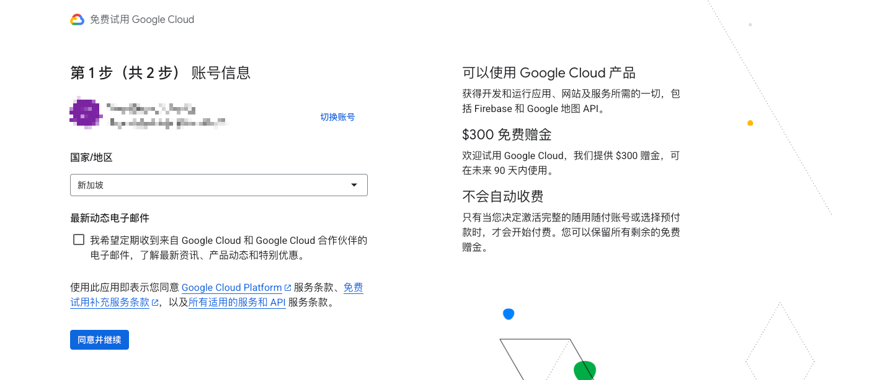
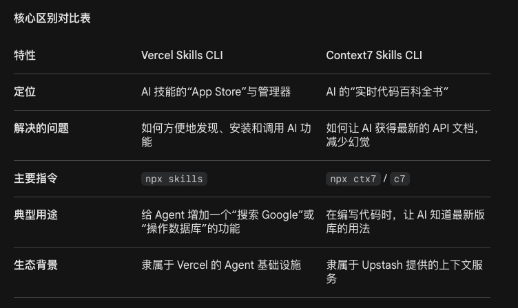

# 一、ai-research-skills

> https://github.com/Jishenshen/ai-research-skill/tree/main

## 1. 设计哲学

一个基于 Agent 和大模型的自动化文献研究工作流。本项目利用 LLM Agent 和定制化技能（Skills）来自动化文献检索、交叉验证、下载归档以及论文的深度精读。

**目标**：自动化采集 20 篇相关论文 → 结构化提取 → Zotero 入库 → 对单篇文献进行精读，或批量扫读

## 2. 工作流总览

本项目**不是**那种试图替代研究者、追求端到端全自动化科研的系统。

它的核心思想很简单：

> **以人的决策为中心，让助手去加速科研流程，而不是替人做最终判断。**

这意味着research-skills更适合承担科研中那些高重复、重结构、但仍需要人来把关的环节，例如文献整理、知识沉淀、实验分析、结果汇报和写作辅助；而真正关键的判断始终应该由研究者自己做出：

- 这个问题值不值得做，
- 哪些文献真正重要，
- 哪些假设值得继续验证，
- 哪些结果足够可信，
- 以及什么应该继续推进、写成论文、投稿，或者及时放弃。

换句话说，我希望`ai-research-skills`是一个**以人类决策为中心的半自动研究助手**，而不是一个“全自动科研代理”。

```
环节1 根据关键词检索采集最新的论文 → 环节2 元数据验证（确保数据的准确性） → 环节3 PDF下载与解析
   ↓
环节4 同步zotero，进行结构化提取（研究问题/方法/发现/局限）
   ↓
环节5 生成结构化综述
```


# 二、前置准备

## 1. 安装Gemini CLi

>  技术文档：https://geminicli.com/docs/get-started/installation/
>
> requirements：Node.js 20.0.0+ [https://nodejs.org/en/download]

### 1.1 安装Gemini CLI

```g l
npm install -g @google/gemini-cli
```

### 1.2 启动Gemini Cli

```
gemini
```

## 2. 准备谷歌账号、软件开发平台Antigravity、API

### 1. 新用户登陆Google Cloud可以享受300刀赠金



### 2. 下载Antigravity

> 下载地址：https://antigravity.google

**介绍：**这是一个智能体式开发平台IDE，能够自主规划、执行、验证和迭代复杂工程任务的行动者，用Trae、codex都可以。

用谷歌账号登录Antigravity可以提供gemini模型的免费配额

### 3. 准备好Gemini API

> 文档地址：https://antigravity.google

### 4. 下载zotero

> 下载地址：https://www.zotero.org

**介绍**：Zotero是一款使用广泛、易学易用、免费开源的文献管理软件。支持文献导入、文献阅读、快速生成参考文献格式


# 三、了解什么是SKILLS和MCP

## 1. skill

> SKILL地址：https://skills.sh，此仓库包含与构建基于 Gemini API 的应用程序相关的技能。告诉它遇到这个命令时该怎么一步步执行。

Skill 文件里写的是给 AI 看的指令，可以为您的智能体添加相关的上下文信息。

### 📁 Skill 的核心目录结构
在本项目中，每个 Skill（如 `literature-search`）通常包含以下两个核心子文件夹，它们承载了不同的设计使命：

*   **`assets/` (项目资产/用户模板)**：
    *   **作用**：存放需要“实例化”给用户使用的文件。
    *   **面向对象**：**用户**。
    *   **逻辑**：Agent 会将这些文件（如 `keywords_template.md`）拷贝到您的项目目录中。它们就像是**“底稿”或“空表”**，由您来填写具体的研究需求。
*   **`references/` (参考规范/AI 榜样)**：
    *   **作用**：存放指导 Agent 输出质量的“说明书”。
    *   **面向对象**：**Agent (AI)**。
    *   **逻辑**：这些文件（如 `quality-criteria.md` 打分标准、`batch_scan_example.md` 排版范例）通常是只读的。Agent 会在执行任务前阅读它们，从而学会**“该按什么标准评价论文”**以及**“该按什么审美进行排版”**。

通过这种“底稿 (Assets) + 榜样 (References)”的设计，我们确保了 AI 既能听懂您的个性化需求，又能输出符合工业级标准的科研报告。

谷歌提供了**Vercel Skills CLI** 和 **Context7 Skills CLI** 两个非常核心的工具。虽然它们都使用了 “Skills”（技能）这个概念，但其侧重点和应用场景有明显区别。

简单来说：**Vercel 侧重于技能的“标准化分发与运行环境”，而 Context7 侧重于为 AI 提供“实时的代码文档上下文”。**



**数据说明**：添加技能后，智能体按照最佳实践生成正确 API 代码的能力在 Gemini 3 Flash 中提升至 87%，在 Gemini 3 Pro 中提升至 96%。

### 管理技能的命令

> https://geminicli.com/docs/cli/skills/

### In an Interactive Session

Use the `/skills` slash command to view and manage available expertise:

- `/skills list` (default): Shows all discovered skills and their status.
- `/skills link <path>`: Links agent skills from a local directory via symlink.
- `/skills disable <name>`: Prevents a specific skill from being used.
- `/skills enable <name>`: Re-enables a disabled skill.
- `/skills reload`: Refreshes the list of discovered skills from all tiers.

### 常用的skills推荐

1. `find-skills`：发现与搜索工具。

   帮你在Github上搜索和发现适合的Skills，按分类、star数、更新时间筛选，找到适合自己需求的技能包。面对大量Skills，不知道选哪个的时候，这个工具就很有用

   ```
   npx skills add https://github.com/vercel-labs/skills --skill find-skills）
   ```

2. `skill-creator`: 创建其他Skills的元技能。

   自动生成符合规范的skill.md，文件和目录结构，提供最佳实践和示例，快速启动技能模板，内置验证确保质量。

## 2. MCP

**解释：**想象 AI 模型是一台电脑，它本身只能处理文字。但现实世界里有各种"外设"——数据库、文件系统、网页浏览器、代码编辑器……

MCP 就是那个 USB 标准：                                                                                                               

  \- 没有 MCP 之前：每个 AI 要连接每个工具，都要单独写一套对接代码（就像每个设备都要专用接口）                                           

  \- 有了 MCP 之后：工具只要实现 MCP 协议，任何支持 MCP 的 AI 都能直接用（就像 USB 设备插哪台电脑都能用）                                                                                                                                                                                                        MCP Server 本质上暴露三类东西给 AI：                                                                                                  

  \- Tools：AI 可以调用的函数（比如"读文件"、"查数据库"）                                                                                

  \- Resources：AI 可以读取的数据（比如文档、配置）                                                                                      

  \- Prompts：预设的提示词模板    


### zotero-mcp

> 地址：https://github.com/54yyyu/zotero-mcp

**作用：**

- AI驱动的语义搜索：基于向量的相似性搜索，覆盖您的整个研究库，提供相似性评分和上下文匹配的智能搜索结果
- 搜索您的图书馆：按标题、作者或内容查找论文、文章和书籍

# 四、执行环节（核心工作流）

整个学术文献工作流被拆解为四个连续的自动化技能（Skill）。建议您按照以下顺序依次执行，只需对 Gemini 助手说出对应的自然语言指令即可。

## 环节 1：文献检索与采集 (literature-search)

**目标**：根据您的研究方向，自动从学术数据库中检索并初步筛选相关论文。

**如何使用**：
1. 向助手下达指令：“启动 literature-search，帮我搜索一下 [您的项目名称] 领域的论文。”
2. 如果是首次运行，助手会在 `projects/[项目名称]/` 目录下生成一个 `keywords.md` 模板文件。
3. 您需要打开该文件，填入您的**关键词**、**搜索年份**以及**期望的最大结果数量**。
4. 填写完毕后，再次对助手说：“配置已完成，请执行文献搜索。”

**它的工作原理**：
工具会自动读取 `keywords.md`，调用后台 Python 脚本进行全网检索。它会抓取所有结果存入 `01_search/raw_papers.csv`，并根据关键词在“标题”（权重2.0）和“摘要”（权重1.0）中出现的频率自动打分排序，最终将筛选后的优质论文保存到 `01_search/papers.csv` 中。

## 环节 2：文献二次验证 (literature-verify)

**目标**：对搜索到的初步结果进行数据清洗、去重，并生成包含中文摘要的文献日报。

**如何使用**：
在完成搜索后，向助手下达指令：“执行 literature-verify，验证 [您的项目名称] 的文献结果。”

**它的工作原理**：
工具会读取上一步的 `papers.csv`，调用 Python 脚本通过 CrossRef、arXiv 等数据库交叉验证 DOI、作者和标题，剔除重复项，生成 `02_verify/verified.csv`。
**最贴心的是**：助手会自动为您生成一份精美的 **《论文日报 (paper_daily.md)》**，按照相关度降序排列，并且为您自动翻译了中文摘要，方便您一目了然地挑选重要文献。

## 环节 3：下载与 Zotero 同步 (literature-ingest)

**目标**：自动下载开源文献的 PDF 全文，并将其连同完整的元数据直接导入您的 Zotero 文献库中。

**如何使用**：
确认日报无误后，向助手下达指令：“使用 literature-ingest，下载 [您的项目名称] 的文献 PDF 并同步到 Zotero。”

**它的工作原理**：
工具会扫描已验证的文献列表，自动寻找开源的 PDF 下载到本地 `03_pdfs/` 文件夹。随后，它会调用 Zotero 同步脚本，在您的 Zotero 中自动创建一个名为 `[项目名称]` 的分类（Collection），并将文献详情与 PDF 附件完美同步进去。

## 环节 4：文献精读与扫读质检 (deep-reading-skills)

**目标**：利用大语言模型（LLM）的强大能力，直接连接您的 Zotero 库进行自动化阅读、打分和提取核心要素。

本阶段包含两种工作模式，您可以根据需要自由选择：

### 模式 A：批量扫读质检 (Batch Scan Mode)
适用于当您面对 Zotero 库中刚导入的几十篇论文，需要快速摸底质量时。
- **指令示例**：“启动批量扫读模式，帮我整理 Zotero 中 [项目名称] 分类下的论文，提取八要素并打分。”
- **输出结果**：助手会生成一份名为 `batch_scan_report_{日期}.md` 的报告。它会对每篇文献进行质量综合打分（0-10分，基于创新性、严谨性等），并自动提取出**“文献阅读八要素”**（如：研究动机、核心问题、创新点、方法、结论、局限性等）。

### 模式 B：单篇深读 (Deep Read Mode)
适用于当您发现了一篇极具价值的核心论文，需要彻底拆解其技术细节（公式、架构、实验）时。
- **指令示例**：“进入单篇深读模式，帮我深度分析 Zotero 里的这篇论文：[论文标题]。”
- **输出结果**：助手会调用 MCP 接口获取该论文全文，并生成一份名为 `[论文标题]_深读报告.md` 的详尽文档。报告中会使用 LaTeX 格式解析核心公式，梳理思想脉络，并进行客观的批判性分析。

**🧠 Skill 设计思路与模板说明**：
- **设计思路**：将 LLM 的角色从“文献阅读器”升级为**“带着批判性思维的学术审稿人”**。技能设计了“广度优先（批量扫读）”和“深度优先（单篇深读）”两种认知模式。为了防止 LLM 在总结时“泛泛而谈”或产生幻觉，特意引入了严格的“强制量化打分”和“结构化要素提取”机制。
- **References 模板 (`quality-criteria.md` & `batch_scan_example.md`)**：
  - **`quality-criteria.md`（质量评估标准）**：这是赋予 LLM “学术品味”的核心文件。它强制规定了 0-10 分的具体打分细则（创新性占 3 分、严谨性占 3 分、影响力占 2 分、表达占 2 分）。LLM 在阅读论文后，必须严格对照此“量规 (Rubric)”给出客观分数和扣分理由。
  - **`batch_scan_example.md`（扫读报告示例）**：它规定了批量扫读的输出 UI 标准。强制 LLM 提取科研人员最关心的“文献阅读八要素”（核心问题、创新点、方法路线、局限性等），保证输出格式高度整齐划一，方便您在阅读时进行多篇论文的快速横向对比分析。

---

## 💡 最佳实践：对话指令全流程

对于初学者，您可以直接按照以下对话流来指挥 Gemini 助手完成一个完整的科研周期：

1. **“执行 literature-search，项目名是 ai-education”** -> 助手生成 `keywords.md`。
2. （您手动修改 `keywords.md` 里的关键词和数量） -> **“配置好了，请再次执行搜索”**。
3. **“验证 ai-education 的搜索结果，并生成论文日报”** -> 查阅生成的日报。
4. **“将 ai-education 验证过的文献下载，并同步到我的 Zotero 中”**。
5. **“启动批量扫读模式，帮我整理 Zotero 中 ai-education 分类下的论文，提取八要素并打分”**。
6. **“进入单篇深读模式，详细分析扫读报告中评分最高的那篇论文”**。